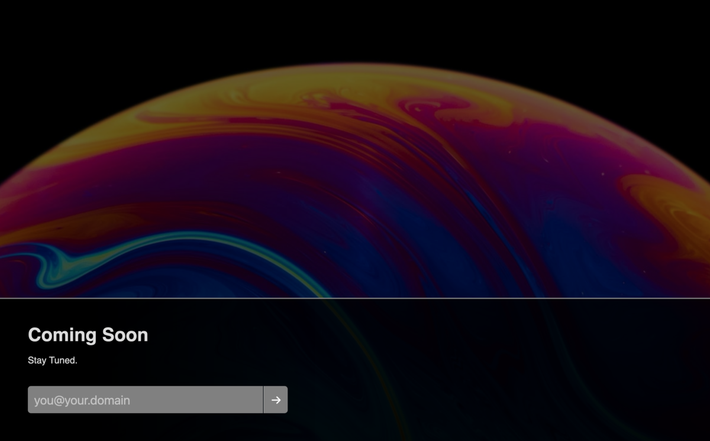

coming-soon
===========

This little application displays a generic (but configurable!)
"Coming Soon!" page, and provides a subscription-by-email form for
visitors to register their interest.  Currently, this results in a
log message with their email address, wich can be pulled from the
container logs in a larger automation.

The following container environment variables are honored:

 - `THE_PAGE_TITLE` - Sets the &lt;title&gt; for the whole page

 - `THE_BACKGROUND_COLOR` - The interim background color,
   displayed when the background image won't load.

 - `THE_BACKGROUND_IMAGE` - The page-relative URL of the
   image to use as the background.  Darker is better.

 - `THE_ACCENT_COLOR` - The accent color used for the border
   and input / button elements.

 - `THE_BODY_TITLE` - The text for the &lt;h1&gt; in the page body.

 - `THE_INTRO_TEXT` - Introductory text (contained in a &lt;p&gt;).

 - `THE_PLACEHOLDER` - Sets the text field placeholder text.

 - `THE_THANKS` - The message to display post-submission.
